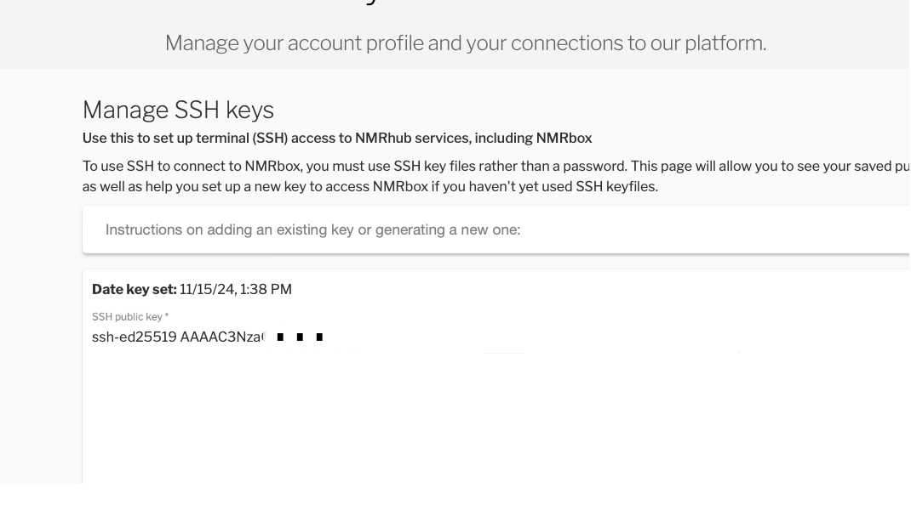

# SSH Troubleshooting

[NMRhub](https://nmrhub.org) now requires an SSH key pair to connect. Use [SSH / SFTP / rsync](https://openssh.com) and tools like [FileZilla](https://filezilla-project.org) to connect to NMRhub virtual machines (VMs).

## Where is my private key?

After following the instructions at [NMRbox User Dashboard SSH Key Setup](https://nmrbox.nmrhub.org/user-dashboard/ssh-key), your private key should be at:
- On Mac/Linux: `$HOME/.ssh/id_ed25519`
- On Windows: `%HOMEDRIVE%%HOMEPATH%\.ssh\id_ed25519`

## I have the private key in place, but I can't connect.

1. Try connecting to more than one VM to make sure it's not just an issue with that specific VM. (Please let us know if you can SSH to one VM but not another via [support@nmrbox.org](mailto:support@nmrbox.org)).
2. Use `ssh -vvv` to verify if SSH is attempting to use your private key.

### It's trying to use the key, but it still doesn't work.

If you can't connect after uploading your SSH key, verify the following commands give the same result. Windows users should run these commands from PowerShell:

```bash
ssh-keygen -lf $HOME/.ssh/id_ed25519
ssh-keygen -lf $HOME/.ssh/id_ed25519.pub
```

Ensure the key listed at [NMRbox User Dashboard SSH Key](https://nmrbox.nmrhub.org/user-dashboard/ssh-key) matches your `$HOME/.ssh/id_ed25519.pub`.



## Home Directory Permissions

If your home directory is writable by anyone other than you, SSH will not work. Connect via [VNC](https://nmrbox.nmrhub.org/pages/getting-started) and run:

```bash
ls -l ~
```

If **`w`** appears after the first group of permissions (e.g., `drwx`), use the following command to correct it:

```bash
chmod go-w ~
```

## How do I use a private key with `rsync`?

Add the following option to your `rsync` command:

```bash
-e "ssh -i /path/to/your/private_key"
```

## How do I use a private key with `sftp`?

Add the following option to your `sftp` command:

```bash
-i /path/to/your/private_key
```

## How do I use a private key with FileZilla?

Go to FileZilla's **Site Manager** and make the following settings in the **General** tab. You can leave the port blank, as it defaults to the correct value (22).

- **Protocol:** SFTP - SSH File Transfer Protocol
- **Host:** *element*.nmrbox.org
- **Port:** [Leave blank]
- **Logon Type:** Key file
- **User:** *username*
- **Key file:** *local path*/.ssh/id_ed25519

## How do I use a private key with [WinSCP](https://winscp.net)?

See [The Authentication Page](https://winscp.net/eng/docs/ui_login_authentication).


# SSH Key Setup for Multi-User Shared Account

This guide covers setting up individual SSH keys for multiple users who share a single system account, with password-protected keys and convenient SSH config entries.

## Overview

When multiple people share one account on a machine, each person should have their own SSH key pair for security and accountability. This setup allows:
- Each user to have a password-protected private key
- Easy identification of who's connecting
- Simple login with SSH config shortcuts

## Part 1: Generate Individual SSH Keys

Each user should generate their own key pair on their local machine (not the shared server).

### Step 1: Create a key pair with a descriptive name

```bash
ssh-keygen -t ed25519 -C "your-email@example.com" -f ~/.ssh/id_ed25519_username
```

**Options explained:**
- `-t ed25519` - Uses the modern Ed25519 algorithm (recommended)
- `-C "your-email@example.com"` - Adds a comment to identify the key
- `-f ~/.ssh/id_ed25519_username` - Specifies the filename (replace `username` with a meaningful value)

**Alternative for older systems:**
If the server doesn't support Ed25519, use RSA instead:
```bash
ssh-keygen -t rsa -b 4096 -C "your-email@example.com" -f ~/.ssh/id_rsa_username
```

### Step 2: Set a strong passphrase

When prompted, enter a strong passphrase to protect the private key:
```
Enter passphrase (empty for no passphrase): [type your passphrase]
Enter same passphrase again: [type your passphrase again]
```

**Important:** Never leave the passphrase empty! On a multi-user machine where others have access to this key, doing this would let other users log in as you.

### Step 3: Verify the keys were created

```bash
ls -la ~/.ssh/id_ed25519_username*
```

You should see two files:
- `id_ed25519_username` - Your private key (keep this secret!)
- `id_ed25519_username.pub` - Your public key (safe to share)

## Part 2: Install Public Keys on the Server

### Step 1: Copy your public key to the server

View your key by running:
```bash
cat ~/.ssh/id_ed25519_username.pub
```

Then add your individual user key to your NMRbox account at https://nmrbox.nmrhub.org/user-dashboard/ssh-key.

## Part 3: Configure SSH Client for Easy Access

On the shared user account, configure the local SSH client to know about the different keys available.

### Step 1: Edit your SSH config file

On your local machine:
```bash
nano ~/.ssh/config
```

### Step 2: Add a host entry

Add this configuration (adjust for your setup) - one record as shown below per user on the machine:
```
Host user1
    HostName krypton.nmrbox.org #or a different NMRbox host
    User user1
    IdentityFile ~/.ssh/id_ed25519_username1
    IdentitiesOnly yes

Host user2
    HostName krypton.nmrbox.org #or a different NMRbox host
    User user2
    IdentityFile ~/.ssh/id_ed25519_username2
    IdentitiesOnly yes

# etc ...
```

**Options explained:**
- `Host user1` - A short alias you'll use to connect
- `HostName` - The actual server address (domain or IP)
- `User` - The shared account username on the server
- `IdentityFile` - Path to your private key
- `IdentitiesOnly yes` - Only use the specified key (prevents trying other keys)

### Step 3: Set proper permissions

```bash
chmod 600 ~/.ssh/config
```

### Step 4: Test the connection

```bash
ssh user1
```

You'll be prompted for your key's passphrase (not the server password). After entering it once, the connection should establish.

Please note that in the SSH example directly above, you don't need to specify a hostname or key - just the alias for the connection (in this case user1) as defined in your `.ssh/config` file.

As you'll have one record for each user with a key on this system, each user can use their own alias to SSH into their own account using the proper key.

## Troubleshooting

### "Permission denied (publickey)"
- Check file permissions: `~/.ssh` should be 700, `authorized_keys` should be 600
- Ensure you're using the correct username and key file
- Try with verbose mode: `ssh -v myserver`

### "Bad permissions" errors
```bash
chmod 700 ~/.ssh
chmod 600 ~/.ssh/config
chmod 600 ~/.ssh/id_ed25519_*
chmod 644 ~/.ssh/*.pub
```

### Can't remember which key is which
```bash
# View public key fingerprint
ssh-keygen -lf ~/.ssh/id_ed25519_username.pub

# List all keys in SSH agent
ssh-add -l
```
